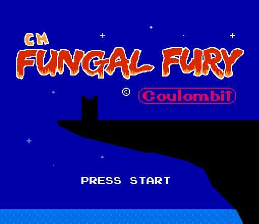

# Fungal Fury

[](image.png)

This is the source code of the NES game **Champignon Magique - Fungal Fury**.

Make sure you have the `ca65` compiler and `ld65` linker installed and use the Makefile to compile the .nes file:

```
make build
```

Then open the `./dist/game.nes` in your favourite emulator!

Enjoy!